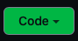

# Your Fist Git Commit

## Step 1: Clone The Repo

First of all, decide where you want the class repo to be in your computer's filesystem.  This is a personal preference, but it makes sense for it to be somewhere that's relatively quick and easy for you to navigate to in your terminal. 

In my home, `/Users/pete`, I have a `code-guild/` folder.  So, I keep all my class repos in there:
```sh
> pwd # I'm in my home directory
/Users/pete
> cd code-guild
> pwd # now I'm in the code-guild directory
/Users/pete/code-guild
```
Now I'm where I want to be to clone the repo.

### `git clone [repo-url]`
`git clone` will pull down the repo from origin (in this case GitHub).  You can get the repo URL by clicking on the green "Code" button on the main page of the repo:



You can copy that url, or just run this command here:
```sh
> git clone https://github.com/PdxCodeGuild/class_koi.git
> # there will be a bunch of output here showing the repo being downloaded...
> # then you can cd into it
> cd class_koi
```

Try `ls` from there if you want to have a look around.

#### Note: do recent changes requiring multi-factor authentication on GitHub, some users might have to run `git clone git@github.com:PdxCodeGuild/class_koi.git` instead.

## Step 2: Make A Branch

Now you're ready to make your own branch.  But first, let's run `git status`:

### `git status`
`git status` is a freebie, a read-only command.  It does not edit or alter anything, it just gives you feedback on the current state of your branch.  Use it as many times as you want to have a good understanding of how git works:

```sh
> git status
On branch main
Your branch is up to date with 'origin/main'.
```

What that is saying is that you're on the default branch and everything is up to date, but git locally doesn't always have the latest information.  So you will pull down the latest from `origin/main` before making a new branch.  Let's talk about the next two commands before we run them.

### `git pull`
`git pull` pulls down the latest changes for your current branch from GitHub.  Always run `git pull` on the main branch before creating a new branch.

### `git checkout -b [branch-name]`
`git checkout` is a command for switching between different branches.  Given the `-b` flag, it will create a new branch with the given name.  Be sure to **replace `[branch-name]` with the actual name of your branch**.  For this class we will be using certain naming conventions for branches.  For this branch it will be `[your-name]/first-commit`.  

Here's what it would look like for me to create this branch:
```sh
> git pull
> # this will give some feedback, saying whether anything was changed or not
> git checkout -b pete/first-commit # be sure to replace pete with your name
Switched to a new branch 'pete/first-commit'
> git status # you can't run this command too many times
On branch pete/first-commit
nothing to commit, working tree clean
```

#### Note: If two or more people have the same name in the class, then this is a good time to discuss how you will differentiate your names.  First name and last initial could work: `pete-j/first-commit`.

Now you've created a branch.  It's time to put something on it.

# Step 3: Create Your Code Folder And Add `.gitkeep`

First of all, `cd` into the `code/` folder:

```sh
> cd code
> pwd # this will be different for everyone, but I can see I'm in the code folder
/Users/pete/code-guild/class_koi/code
```

Now make your personal code folder.  This is where you will be storing your labs.  All the work you do on the repo will be inside your personal folder:

```sh
> mkdir pete # use your name instead
> cd pete # go ahead and cd into the new folder
```

Once again, if you share a name with a classmate, be sure to use something distinct from one another.

#### Note: I recommend going with the all lower-case version of your name, especially if you plan on traversing your file structure with the command line.  However, many modern shells have case-agnostic autocompletion so it may not matter so much.

Let's run `git status` to see if git has recognized your new folder:
```sh
> git status
On branch pete/first-commit
nothing to commit, working tree clean
```

Git hasn't recognized the new folder.  This is because git keeps track of files, not folders.  It only cares about folders for the files within them.  So we need to add a file to your code folder:

```sh
> pwd # checking where I am
/Users/pete/code-guild/class_koi/code/pete
> touch .gitkeep
> git status
On branch pete/first-commit
Untracked files:
  (use "git add <file>..." to include what will be commited)
        .gitkeep
```

Now that there's a file there, git sees something new.

#### Note: `.gitkeep` is a blank text file used as a placeholder.  It doesn't matter what the file is called, but `.gitkeep` is used as a convention.  It's "keeping" the folder for later.

## Step 4: Add, Commit & Push

### `git add [filepath]`
`git add`, given a filepath, will add that file to version control.  Since the only file you need to add is your `.gitkeep`, you can do this:

```sh
> git add .gitkeep
> git status # let's see what that did!


## Using Git With VS Code:
[https://code.visualstudio.com/docs/editor/versioncontrol](https://code.visualstudio.com/docs/editor/versioncontrol)